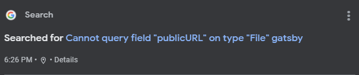

I've always believed in working smarter not harder. 

Especially when it comes to programming. There are multitudes of languages, frameworks, ideas etc. out there that no one can truly remember or retain the knowledge of it all. I'm the first to admit I am not confident in my programming abilities, which is why I set myself small tasks in languages I think would help. Here are my most helpful things for those just starting web development or any type of programming.

### Learn How to Google

This may seem like a silly one however being able to research and ask the right questions to find the solution to your problem is such a great skill to have. Using keywords like the framework or language your using is a start, then narrow it down but using error codes or console messages in your browser. Sometimes it will take a bit of tweaking to get the keywords or the right site links.  

Here are some examples I have used:

### Plugins

Plugins are a great way to get that functionality installed. Don't get me wrong there is something very satisfying about doing it all yourself, but sometimes it
just doesn't work right and having the hard work done for you is fantastic. That isn't to say that plugins don't come without their faults. A lot of plugins are created by other developers and have their bugs, arent updated frequently to work with your current package managers or frameworks. 
Which is where GitHub documentation (next on the list) and the workflow of Github issues helps.

The Comments sections on these posts were created using a plugin called [Gatsby Plugin Disqus](https://www.gatsbyjs.com/plugins/gatsby-plugin-disqus/)

### Documentation and tutorials

This is probably another no brainer however
Documentation is a must when developing. Good documentation even more-so. When I got to the third year of my degree we chose the groups that we wanted to work in. I did IOT with a web dev twist. I was tasked to work on a site that had very little documentation on how to get it to run in languages I didn't know. I didn't do well, but the fact remains I couldn't understand the documentation. And when looking for answers bad documentation will set you back so always check the documentation first and make sure you kind of understand how to use it.
Youtube tutorials are super helpful as well, however depending on how new the language or framework or plugin is, people may not have made tutorials yet. When I start a new language or framework I always try to find a really good youtube tutorial to help me get used to the file system, then I jump into the docs.  

### Stackoverflow

Honestly, I wouldn't have made it through this degree without [StackOverflow](https://stackoverflow.com/). Majority of the site link answers in google have sent me to StackOverflow questions where others have faced the same problem and people have given different ways of fixing the issue and I have asked a few questions. Don't be afraid some people comment to feel high and mighty, but they had to start somewhere. Just make sure you include code examples, a codepen and images to help show the full problem for better answers.

Leave your helpful tips, thoughts and opinions below in the comments 

<small>This is my first ever blog post please be kind :)</small>
